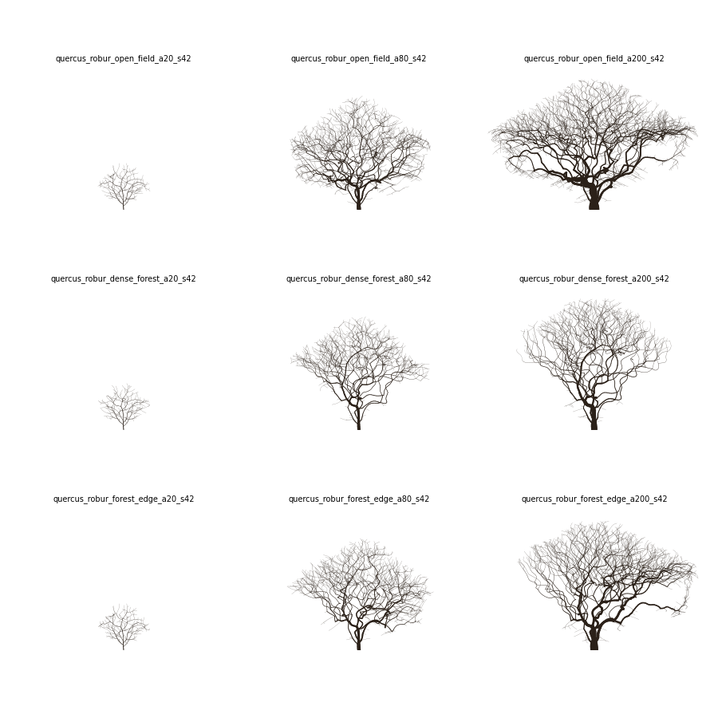

# treegen — Phase 1

Headless, USD-native procedural tree generator. Space colonization plus a light
occlusion field drives the skeleton; the USD output ships the skeleton as a
first-class FX deliverable. Geometry only: no foliage, no texturing, no welding.

Status: prototype covering design-doc milestones M1–M5 and a first pass at M7.
The Hydra viewer (M6) is not built yet — use `--watch` with usdview/Solaris/Blender.



*Oak at 20 / 80 / 200 years in open field, dense forest and forest edge. Only age
and neighbour placement differ.*

## Install

Needs Python 3.11+. `usd-core` comes from PyPI, so no USD build is required.

```bash
git clone <repo> treegen && cd treegen
python3 -m venv .venv
source .venv/bin/activate            # Windows: .venv\Scripts\activate
pip install -e ".[dev]"              # core + matplotlib previews + pytest
pytest                               # ~10 s
```

`pip install -e .` alone gives the core and USD writer without the PNG previews.

## Usage

```bash
# one tree
treegen species/quercus.toml --seed 42 --age 80 -o out/oak_042.usda

# with neighbours, plus a silhouette PNG (modes: skeleton | light | shed)
treegen species/quercus.toml --age 80 --scene scenes/forest_edge.toml -o out/edge.usda --png --png-mode light

# batch: ages x scenes x seeds, output is a directory
treegen species/quercus.toml --ages 20,80,200 --scenes scenes/open_field.toml,scenes/dense_forest.toml -o out/

# variant browsing without a viewer: 12 seeds, skeletons only, one contact sheet
treegen species/quercus.toml --seeds 1-12 --skeleton-only --contact-sheet out/variants.png

# tuning loop: regenerate whenever the species or scene file is saved
treegen species/quercus.toml --age 80 -o out/oak.usda --watch

# the Phase 1 definition-of-done batch
./scripts/definition_of_done.sh
```

Open `out/oak.usda` in usdview, Solaris (sublayer or reference), Blender (USD import),
Maya (mayaUSD) or Gaffer. The skeleton has `purpose = guide`; enable guides to see it.
`--lod` changes geometry resolution only — the simulation is never LOD'd.
`--flatten` writes a single file instead of the layer stack.

Growth results are cached in `.treegen_cache/` keyed by the parameters that affect
growth, so changing `[geometry]` or `[radii]` re-runs in well under a second.

| Flag | Meaning |
| --- | --- |
| `--seed / --seeds` | one seed / batch (`1-12`, `3,7,9`) |
| `--age / --ages` | years (default: `meta.reference_age`) |
| `--scene / --scenes` | neighbour proxy files (default: open field) |
| `-o` | root `.usda`/`.usdc`, or a directory for batches |
| `--skeleton-only` | skip geometry and USD (fast M1–M4 loop) |
| `--png`, `--png-mode`, `--contact-sheet` | matplotlib previews |
| `--lod`, `--flatten` | geometry resolution, single-file output |
| `--watch`, `--no-cache`, `--cache-dir`, `-q` | workflow |

## Layout

```
treegen/
  schema.py        every parameter: default, range, unit, group, doc (panel will be generated from this)
  pipeline.py      stage caching: growth -> skeleton -> geometry
  core/            age, envelope, light, growth, skeleton (extraction), radii, refine
  geo/             frames (parallel transport — part of the contract), sweep (meshes, curves, UVs, binding)
  usd/             stage (layers, primvars, subsets, materials)
  cli/             argparse entry point
  preview.py       silhouettes and contact sheets
species/           quercus (tuned), pinus and betula (untuned first passes)
scenes/            open_field, dense_forest, forest_edge
docs/USD_CONTRACT.md
tests/
```

## Scene files

```toml
name = "my_scene"
[[neighbour]]
type = "capsule"          # capsule (p0, p1, radius) | sphere (center, radius) | box (center, size)
p0 = [6.0, 5.0, 0.0]
p1 = [6.0, 13.0, 0.0]
radius = 3.2
density = 1.5             # optical depth per metre
age_scaled = true         # grows with the tree's height curve (same-age stand)
```

Space inside a proxy counts as occupied: the tree cannot grow there.

## How it works

1. **Attractors** are seeded once in the largest envelope the tree will ever have. Each
   one activates the year the growing envelope reaches it, so a young tree is the
   literal past of an old one.
2. **Colonization** runs `iterations_per_year` steps per year. Directions are weighted by
   attractor exposure. Apical bias, heading memory and a gravitropism clamp are applied,
   and a branch-angle constraint is enforced on laterals.
3. **Every `epoch_years`** the occlusion grid is rebuilt from the tree's own tips plus
   neighbours. Three things follow:
   - Growth vigor is allocated root-to-tip, favouring the leader (Borchert–Honda style).
   - Limbs whose best tip exposure falls below `shed_threshold` are shed. Big limbs
     leave dead stubs, and the shed limbs' pipes still count toward trunk thickness.
   - Old trees may die back at the top (reiteration).
4. **Extraction**: the continuation child at each fork is the heaviest subtree. In old
   trees, near-equal forks become co-dominant stems.
5. **Radii and refinement**: pipe model, age-dependent trunk thickening, junction swell,
   flare, chain smoothing, gravity droop by downstream mass, phototropism, noise.
6. **Geometry and USD**: see `docs/USD_CONTRACT.md`.

### Age semantics

Normalised age `n = age / max_age` indexes every `age_response` curve. Curves that
modify a base value (`height`, `trunk_radius`, `apical_dominance`, `shed_threshold`)
are applied as `curve(n) / curve(n_ref)`, so the species file is exactly true at
`reference_age`. `crown_flatten` is applied as a delta from the reference age;
`reiteration` is absolute.

## Known limitations / next steps

- **Envelope vs light**: the envelope caps height, so forest trees cannot outgrow the
  stand and the bare bole is shorter than it should be. Candidate fix: soften the
  envelope to a bias once the light field exists.
- **Occasional looping limbs** in shaded crowns. Colonization still chases lit
  attractors around the crown shell; it is visible in the dense forest at 80 years.
- **Scenes are identical at 20 years**: same-age neighbours have not closed canopy yet.
- **Conifers**: whorled branching is not modelled; `pinus.toml` is a silhouette only.
- **Naming**: `branchPath` is hierarchical, but inserting a lateral renames later siblings.
- **Twigs material**: a single binding on `/Tree/Geom/Twigs` (majority order range);
  key per-curve lookdev off `primvars:branchOrder`.
- **Frames**: the root frame seeds from world +X. It is stable under sim-scale tilts,
  not under arbitrary rotation of the whole skeleton.
- **Not yet built**: viewer (M6), junction welds, UsdSkel export, mesh/implicit envelopes.
