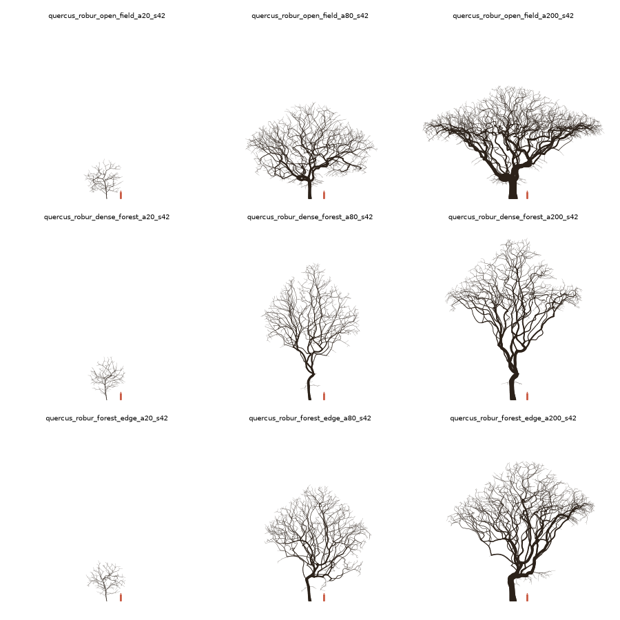

# treegen — Phase 1

[](https://github.com/csmallfield/treegen/actions/workflows/tests.yml)

Headless, USD-native procedural tree generator. Space colonization plus a light
occlusion field drives the skeleton; the USD output ships the skeleton as a
first-class FX deliverable. Geometry only: no foliage, no texturing, no welding.

Status: prototype covering design-doc milestones M1–M6 and a first pass at M7. The design doc
is [docs/Treegen___Phase_1_Design_Doc.md](docs/Treegen___Phase_1_Design_Doc.md).



*Oak at 20 / 80 / 200 years in open field, dense forest and forest edge. Only age
and neighbour placement differ.*

## Install

Needs Python 3.11+. `usd-core` comes from PyPI, so no USD build is required.

```bash
git clone <repo> treegen && cd treegen
python3 -m venv .venv
source .venv/bin/activate            # Windows: .venv\Scripts\activate
pip install -e ".[dev]"              # core + matplotlib previews + pytest
pytest                               # ~10 s
```

`pip install -e .` alone gives the core and USD writer without the PNG previews.

## Usage

```bash
# one tree
treegen species/quercus.toml --seed 42 --age 80 -o out/oak_042.usda

# with neighbours, plus a silhouette PNG (modes: skeleton | light | shed)
treegen species/quercus.toml --age 80 --scene scenes/forest_edge.toml -o out/edge.usda --png --png-mode light

# batch: ages x scenes x seeds, output is a directory
treegen species/quercus.toml --ages 20,80,200 --scenes scenes/open_field.toml,scenes/dense_forest.toml -o out/

# variant browsing without a viewer: 12 seeds, skeletons only, one contact sheet
treegen species/quercus.toml --seeds 1-12 --skeleton-only --contact-sheet out/variants.png

# tuning loop: regenerate whenever the species or scene file is saved
treegen species/quercus.toml --age 80 -o out/oak.usda --watch

# the Phase 1 definition-of-done batch
./scripts/definition_of_done.sh      # or .\scripts\definition_of_done.ps1 on Windows

# the same batch as numbers (height, crown base, crown width, lean, DBH), compared
# against the recorded baseline; --set tries a parameter without editing the TOML
python scripts/dod_metrics.py --compare docs/metrics/dod_baseline.json
python scripts/dod_metrics.py --set envelope.shade_response=0.3 --compare docs/metrics/dod_baseline.json

# interactive viewer in the browser
treegen --serve
```

## Viewer

`treegen --serve` starts a local server on `127.0.0.1:8765` and opens a browser. The
parameter panel is generated from `schema.py`, so a new parameter appears there with no
viewer code. Buttons write USD, save the tuned species back to TOML, and render a
9-seed variant grid.

The viewer draws treegen's own arrays with three.js — it is not a Hydra viewport. The
`usd-core` wheel ships no imaging, so a real Hydra view means NVIDIA's prebuilt USD and
its own Python. Use the viewer for tuning and usdview for verifying the USD itself.

**The parameter panel is tiered by cost.** A coloured dot on each row says what a change
invalidates: green = geometry only, amber = skeleton + geometry, red = a full simulation.
Green and amber rows update live while you drag (about 50-100 ms round trip, because the
simulation is reused from cache); red rows are debounced and re-simulate. A request that a
newer one has replaced is dropped (HTTP 409, ignored by the page), and a simulation still
running is cancelled when the newer request needs a different one, so dragging a red
slider never builds a queue. Drag the bar on the panel's left edge to resize it.

**Debug views**: the display section can overlay the attractor cloud (grey = never reached,
green = active, blue = consumed, red = shaded out), the crown envelope at the current age,
and the skeleton and shed limbs. Attractors and envelope are only sent when their toggle is
on, since the cloud adds about 1 MB.

**Variant grid** renders nine seeds in worker processes and fills an overlay on the viewport
as each finishes: one side-view skeleton silhouette per seed, all framed by the envelope at
that age so heights compare directly. Click a tree to load its seed; Esc closes the grid.
Expect roughly (seeds / cores) x one simulation.

**The HUD shows DBH**, the trunk diameter at 1.3 m. The radius at the very base of the trunk
includes the root flare and reads about 1.4x larger.

**The age slider has two modes.** Dragging runs a fast approximation: the tree is
simulated once at `max_age` and truncated by birth year, which is ~50 ms per frame after
the first simulation. Green and amber edits keep that simulation; only red edits, a new
seed or a new scene pay for it again. Releasing re-runs the real simulation for that age when *exact on
release* is ticked. The approximation differs because shedding, vigor and refinement all
ran at the older age; heights land within a few percent, but treat it as a scrub preview,
not as ground truth.

three.js loads from unpkg, so the viewer needs internet on first load. To work offline,
download `three.module.js` and `OrbitControls.js` next to `index.html` and point the
import map at them.

Open `out/oak.usda` in usdview, Solaris (sublayer or reference), Blender (USD import),
Maya (mayaUSD) or Gaffer. The skeleton has `purpose = guide`; enable guides to see it.
`--lod` changes geometry resolution only — the simulation is never LOD'd.
`--flatten` writes a single file instead of the layer stack.

Growth results are cached in `.treegen_cache/` keyed by the parameters that affect
growth, so changing `[geometry]` or `[radii]` re-runs in well under a second.

| Flag | Meaning |
| --- | --- |
| `--seed / --seeds` | one seed / batch (`1-12`, `3,7,9`) |
| `--age / --ages` | years (default: `meta.reference_age`) |
| `--scene / --scenes` | neighbour proxy files (default: open field) |
| `-o` | root `.usda`/`.usdc`, or a directory for batches |
| `--skeleton-only` | skip geometry and USD (fast M1–M4 loop) |
| `--png`, `--png-mode`, `--contact-sheet` | matplotlib previews |
| `--lod`, `--flatten` | geometry resolution, single-file output |
| `--serve`, `--port`, `--no-browser` | browser viewer |
| `--watch`, `--no-cache`, `--cache-dir`, `-q` | workflow |

## Layout

```
treegen/
  schema.py        every parameter: default, range, unit, group, doc (panel will be generated from this)
  pipeline.py      stage caching: growth -> skeleton -> geometry
  core/            age, envelope, light, growth, skeleton (extraction), radii, refine
  geo/             frames (parallel transport — part of the contract), sweep (meshes, curves, UVs, binding)
  usd/             stage (layers, primvars, subsets, materials)
  cli/             argparse entry point
  preview.py       silhouettes and contact sheets
  viewer/          local server (stdlib http), binary payload packer, parallel variant jobs,
                   single-file three.js frontend
species/           quercus (tuned), pinus and betula (untuned first passes)
scenes/            open_field, dense_forest, forest_edge
docs/USD_CONTRACT.md
tests/
```

## Scene files

```toml
name = "my_scene"
[[neighbour]]
type = "capsule"          # capsule (p0, p1, radius) | sphere (center, radius) | box (center, size)
p0 = [6.0, 5.0, 0.0]
p1 = [6.0, 13.0, 0.0]
radius = 3.2
density = 1.5             # optical depth per metre
age_scaled = true         # grows with the tree's height curve (same-age stand)
```

Space inside a proxy counts as occupied: the tree cannot grow there.

## How it works

1. **Attractors** are seeded once in the largest envelope the tree will ever have. Each
   one activates the year the growing envelope reaches it, so a young tree is the
   literal past of an old one. With `envelope.shade_response > 0`, the envelope first
   measures how much sky the neighbour proxies take from the crown's sides, and from
   which side the light comes. Each year's envelope is stretched to
   `height x (1 + k*shade)`, `radius / (1 + k*shade)` and sheared toward the open side
   by `k * asymmetry` of its radius at the top (base stays at the trunk): shade
   avoidance, with the edge lean still coming only from neighbour placement. The open
   field has no shade, so it is never affected.
2. **Colonization** runs `iterations_per_year` steps per year. Directions are weighted by
   attractor exposure. Apical bias, heading memory and a gravitropism clamp are applied,
   and a branch-angle constraint is enforced on laterals.
3. **Every `epoch_years`** the occlusion grid is rebuilt from the tree's own tips plus
   neighbours. Three things follow:
   - Growth vigor is allocated root-to-tip, favouring the leader (Borchert–Honda style).
   - Limbs whose best tip exposure falls below `shed_threshold` are shed. Big limbs
     leave dead stubs, and the shed limbs' pipes still count toward trunk thickness.
   - Old trees may die back at the top (reiteration).
4. **Extraction**: the continuation child at each fork is the heaviest subtree. In old
   trees, near-equal forks become co-dominant stems.
5. **Radii and refinement**: pipe model, age-dependent trunk thickening, junction swell,
   flare, chain smoothing, gravity droop by downstream mass, phototropism, noise.
6. **Geometry and USD**: see `docs/USD_CONTRACT.md`.

### Age semantics

Normalised age `n = age / max_age` indexes every `age_response` curve. Curves that
modify a base value (`height`, `trunk_radius`, `apical_dominance`, `shed_threshold`)
are applied as `curve(n) / curve(n_ref)`, so the species file is exactly true at
`reference_age`. `crown_flatten` is applied as a delta from the reference age;
`reiteration` is absolute.

## Known limitations / next steps

- **Envelope vs light**: the envelope caps height. `envelope.shade_response` lets a
  shaded crown stretch taller and narrower and lean toward open sky (default 0; the oak
  uses 0.6). `docs/metrics/dod_hard_envelope.json` holds the oak's numbers from before,
  and `docs/HANDOFF.md` the comparison.
- **Occasional looping limbs** in shaded crowns. Colonization still chases lit
  attractors around the crown shell; it is visible in the dense forest at 80 years.
- **Scenes are identical at 20 years**: same-age neighbours have not closed canopy yet.
- **Conifers**: whorled branching is not modelled; `pinus.toml` is a silhouette only.
- **Naming**: `branchPath` is hierarchical, but inserting a lateral renames later siblings.
- **Twigs material**: a single binding on `/Tree/Geom/Twigs` (majority order range);
  key per-curve lookdev off `primvars:branchOrder`.
- **Frames**: the root frame seeds from world +X. It is stable under sim-scale tilts,
  not under arbitrary rotation of the whole skeleton.
- **Viewer**: no Hydra, no curve editing (curves and lists are JSON text fields), no light
  field slice view, and a parameter change invalidates the fast-scrub cache, so the next
  drag pays for one full simulation.
- **Performance is single-threaded CPU**: numpy and scipy do all the work in one thread and
  the GPU is used only to draw the viewport. Extra cores help batches and the variant grid,
  not one tree.
- **Not yet built**: junction welds, UsdSkel export, mesh/implicit envelopes.
