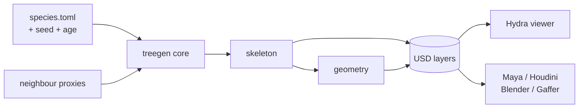
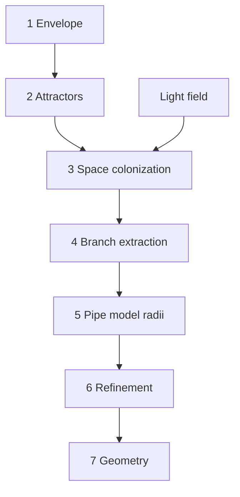

# Treegen — Phase 1 Design Doc

2026-09-17 · @Someone

Geometry-only procedural tree generator. Headless USD core, Hydra viewer, utilitarian UI. No foliage, no texturing, no branch welding in this phase.

## 1. Scope and goals

Phase 1 proves the simulation model and the USD contract. It is deliberately not a product — once it works, a separate design pass defines the real tool.

The deliverable is a headless core that takes a species profile plus a seed and writes a USD file, with a thin Hydra-based viewer for interactive tuning.

### Goals

- Generate a convincing **hero tree**: single tree, static, viewed close, rendered offline with no polygon budget.
- **Realism over directability.** Few powerful controls, not a hundred knobs. Where biology and art-direction conflict in Phase 1, biology wins.
- **DCC-agnostic.** USD out, no host dependency in the core. Maya, Blender, Houdini, Gaffer, Karma, Arnold and Cycles all consume it by referencing a layer.
- **Deterministic.** Same profile plus same seed produces identical output, forever.
- **The skeleton is a first-class deliverable**, not a debug aid. The curve hierarchy ships in the USD so an FX artist can drive wind or interaction downstream.

### Out of scope for Phase 1

| Excluded | Why |
| --- | --- |
| Leaves and foliage | Separate generator, separate phase. Instancing hooks designed for, not populated. |
| Textures, materials, UV refinement | Lookdev is the DCC's job. Primvars are emitted so shading happens downstream. |
| Branch welding and junction fillets | Real mesh surgery. Caps are acceptable for now. |
| Wind, LODs, imposters | The expensive commercial moat. Not needed for hero work. |
| Roots, bark displacement, damage | Later. |
| Species library | Two or three test species only. |
| Node graph UI | Contradicts the limited-controls position. Flat parameter panel instead. |
| Direct branch manipulation | The moment branches are draggable, the simulation stops being the source of truth. |

### Definition of done

A CLI that produces an oak at three ages and in three competition scenarios — open field, dense forest, forest edge — where the silhouettes differ correctly with no parameter change other than age and neighbour placement. Plus a viewer that makes tuning that oak feel responsive.

## 2. Architecture

The core is headless and knows nothing about any DCC or any UI. The viewer is a client of it, not a container for it.

```
treegen species/quercus.toml --seed 42 --age 80 -o oak_042.usdc
```

This inverts the usual plugin-first order and removes the per-host integration tax entirely. Plugins, if they ever happen, become thin wrappers that shell out to the CLI and reference the result.



### Layering

| Layer | Responsibility | Depends on |
| --- | --- | --- |
| `core` | Growth simulation, skeleton, radii, refinement | numpy, scipy |
| `geo` | Sweeps, framing, tessellation, UVs | core |
| `usd` | Stage authoring, primvars, layer structure | core, geo, pxr |
| `cli` | Argument parsing, profile loading, batch runs | all above |
| `viewer` | Hydra viewport, parameter panel, age scrub | cli as a library |

The viewer imports the core as a library and holds the stage in memory rather than round-tripping through disk. Everything else about it is a client.

### The no-viewer fallback

For the first weeks of development, skip the viewer entirely: write the USD and let usdview, Solaris or Blender watch the file and reload. This is an afternoon of work and it reveals which parameters actually get reached for before any of them are committed to widgets.

The viewer earns its place only once the age axis exists, because a simulation cannot be felt through a save-reload cycle.

## 3. Generation pipeline

Space colonization for the skeleton, not L-systems and not parametric branch generators. Rewrite rules are unintuitive to art-direct, and parametric generators (Weber-Penn, which is what SpeedTree descends from) give the most control and the least biological correctness. Space colonization produces far better silhouettes and responds naturally to environment.

Reference: Runions, Lane and Prusinkiewicz, *Modeling Trees with a Space Colonization Algorithm*, 2007 — a 3D extension of their earlier leaf-venation work.



### 1. Envelope

The canopy volume, and the primary art control. A profile curve revolved around the vertical axis, or an imported mesh. Needs only a point-inside test.

### 2. Attractor seeding

Poisson-disc or uniform-random points inside the envelope, seeded deterministically. Count is the dominant density control.

### 3. Space colonization

Standard loop: associate each attractor with its nearest node within the influence radius, move each influenced node one step along the normalised sum of its attractor directions, kill attractors that come within the kill radius.

Character comes almost entirely from the **ratio of influence radius to step length**. Kill distance controls density. Use a `scipy.cKDTree` rebuilt per iteration — this is the hot loop and it is already C.

Apical dominance biases the vertical component early in the run and weakens with age.

### 4. Branch extraction

Space colonization yields nodes, not branches. Walk the tree; at each bifurcation, pick a **continuation** child by largest downstream subtree weight, and treat the rest as **laterals**. This produces branch chains with order indices.

Easy to skip, painful to retrofit — order indices are needed for UVs, taper, material assignment and later leaf placement.

### 5. Pipe model radii

`r_parent^n = Σ r_child^n`, with `n` between 2.0 and 2.5. A single post-pass over the skeleton.

Highest realism-per-line-of-code in the system. Broccoli-looking trees are almost always uniform-taper trees.

### 6. Refinement passes

Order matters; run in sequence.

1. **Gravity droop** weighted by accumulated downstream mass. Iterate twice so terminal branches sag under their own load.
2. **Phototropism** — bend toward the local light gradient.
3. **Trunk flare** at the base and junction swelling at bifurcations.
4. **Per-node noise**, low amplitude, so nothing reads as machined.

### 7. Geometry

- Orders 0–1: swept mesh tubes, **parallel-transport frames** (Hanson and Ma), not Frenet — Frenet flips at inflection points. Radial segment count adaptive to radius.
- Orders 2+: USD `BasisCurves`. Arnold, Cycles and Karma render curves natively, which skips an enormous amount of tessellation and welding work.
- Junction welds: trunk only, and deferred past Phase 1. Caps elsewhere.
- UVs: V along arc length with consistent texel density, U around the sweep.

## 4. Light and competition

One occlusion field drives attractor weighting, branch shedding, asymmetry and field-versus-forest behaviour. This is the design decision that makes the control set small and powerful rather than large and fiddly.

Build it carefully and early. Everything downstream becomes sensitive to it, so treating it as a shedding detail is a mistake.

### The field

A voxel grid over the scene bounds, resolution around 64³ for a hero tree. Each cell accumulates occlusion from:

- **The tree itself** — its own canopy above, which is the dominant term. New growth shades old growth beneath it.
- **Neighbour proxies** — capsules, boxes and spheres placed in the scene.
- **Optional sky mask** — hemisphere weighting so overhead light dominates.

Sample exposure per node by hemisphere ray-marching through the grid, or by a cheaper cone lookup. Store it as `lightExposure` on every skeleton node.

### What falls out of it

| Scenario | Occlusion pattern | Resulting tree |
| --- | --- | --- |
| Open field | None | Low first branch, wide spreading crown, short trunk, retained lower limbs |
| Dense forest | Heavy lateral | Tall bare bole, small crown only at the top, self-pruned |
| Forest edge | Asymmetric | Leans and grows into the clearing, with no lean parameter |
| Under canopy | Heavy overhead | Suppressed, flattened, slow |

Forest edge is the payoff: an emergent behaviour nobody authored.

### Branch shedding

After each growth epoch, cull nodes whose exposure falls below `shed_threshold`, along with their downstream subtrees. Real trees are hollow inside; this is the single biggest difference between a generated tree and a photographed one, and it is cheap.

Keep shed branches in a separate list rather than discarding them — the viewer ghosts them in as a display mode, which is the main tool for understanding what the simulation did.

### Age

Age is not a scale multiplier. It is largely iteration count, with rule changes interleaved:

- **Young** — strong apical dominance, conical crown, retained lower limbs, thin trunk.
- **Mature** — dominance weakens, crown broadens, lower branches shed as the canopy closes above.
- **Old** — **reiteration**: the leader is lost and multiple co-dominant stems take over, producing the flat-topped chaotic crown of an old oak. Plus dead limb stubs and a thick trunk relative to height.

Reiteration is what distinguishes an old tree from a scaled-up young one. It is a rule change in the continuation-selection step, not new machinery.

### Caching

Coupling costs predictability — moving a neighbour changes the whole tree, not just one side. Cache the occlusion field per scene layout and expose a **bake neighbours** step so the tree stays stable while other parameters are tuned.

## 5. Species profile

Species describes a *kind* of tree. Age, seed and neighbours describe *this* tree, and are passed on the command line or set in the viewer — never stored in the species file.

Base values describe the tree at `reference_age`; `age_response` curves describe how it departs from that. Without this split, every age needs its own file, which is unmaintainable.

```toml
[meta]
name = "quercus_robur"
reference_age = 80

[envelope]
shape = "profile"          # profile | mesh | implicit
profile = [[0,0],[0.3,0.9],[0.7,1.0],[1,0.2]]
height = 22.0
spread_ratio = 1.15

[growth]
attractor_count = 8000
influence_radius = 2.2     # relative to step_length
kill_radius = 0.9
step_length = 0.35
apical_dominance = 0.75

[architecture]
branch_angle = { mean = 48, var = 12 }
max_order = 4
min_radius_for_mesh = 0.04

[radii]
pipe_exponent = 2.3
trunk_flare = { amount = 0.4, height = 0.08 }
junction_swell = 1.15

[refinement]
gravity_droop = 0.45       # scaled by downstreamMass
phototropism = 0.2
noise = { amplitude = 0.08, frequency = 2.0 }

[light]
shed_threshold = 0.15
grid_resolution = 64

[geometry]
mesh_orders = [0, 1]       # above this, BasisCurves
radial_segments = { min = 6, max = 24 }

[materials]
order_ranges = [[0,1,"bark_mature"], [2,4,"bark_young"]]

[age_response]             # multipliers as curves over normalised age
height = [[0,0.1],[0.3,0.7],[1,1.0]]
trunk_radius = [[0,0.05],[1,1.0]]
crown_flatten = [[0,0.0],[1,0.6]]
apical_dominance = [[0,1.0],[1,0.3]]
shed_threshold = [[0,0.05],[1,0.3]]
reiteration = [[0,0.0],[0.8,0.4]]
```

### Schema handling

The parameter panel is generated from the schema, so adding a parameter means editing one file, not touching UI code. Define the schema once — ranges, defaults, units, group — and let both the TOML validator and the panel read it.

### Instance parameters

| Parameter | Source | Notes |
| --- | --- | --- |
| `seed` | CLI or variant grid | Drives all randomness; one integer |
| `age` | CLI or timeline scrub | Years; indexes every `age_response` curve |
| `neighbours` | Scene file or viewer proxies | List of primitives with transforms |
| `lod` | CLI | Geometry resolution only — never the simulation |

## 6. USD output contract

This is the part that must be right in Phase 1, because everything downstream depends on it and changing it later breaks other people's work.

### Layer structure

```
oak_042.usda            # root, sublayers the rest
  ├─ skeleton.usdc      # authoritative — curves + all primvars
  ├─ geometry.usdc      # derived — meshes and BasisCurves
  └─ materials.usda     # bindings only, overridable
```

The skeleton layer is **authoritative**; geometry is derived from it. Regenerating geometry at a different resolution must not invalidate a downstream simulation. A lookdev artist overrides the material layer without touching geometry.

### Prim hierarchy

```
/Tree
  /Skeleton          BasisCurves — the branch hierarchy
  /Geom
    /Trunk           Mesh, GeomSubsets by branch order
    /Branches        Mesh
    /Twigs           BasisCurves
  /Proxy             low-res, purpose = proxy
  /Foliage           empty PointInstancer — Phase 2 hook
```

### Primvars

On skeleton curves:

| Primvar | Type | Use |
| --- | --- | --- |
| `parentIndex` | int | Hierarchy traversal |
| `branchOrder` | int | Material assignment, filtering |
| `arcLength` | float | UVs, ramps |
| `radius` | float | Already the curve width |
| `downstreamMass` | float | Wind stiffness — the key FX channel |
| `lightExposure` | float | Shading, later leaf density |
| `birthAge` | float | When this branch appeared |

On geometry, additionally `skelPointIndex` (int) and `skelLocalOffset` (vector3f).

### Skeleton binding for FX

Every mesh point, curve point and future leaf instance carries its nearest skeleton point index plus its position in that point's parallel-transport frame. A Houdini artist then simulates the skeleton however they like, rebuilds frames, and reconstructs the geometry in roughly six lines of VEX. No skinning solve, no weight painting.

`UsdSkel` is the more standard answer and imports cleanly to Maya and Blender, but a hero tree has thousands of joints and it gets heavy. Ship the primvar binding as the default; add `UsdSkel` later only if asked.

### Naming

**Deterministic prim names**, derived from each branch's path through the hierarchy — not from generation index. A small parameter change must not renumber everything and break downstream overrides. Easy to get wrong, very annoying later.

### Units and up-axis

Metres, Y-up, with `metersPerUnit` and `upAxis` authored explicitly on the root layer.

## 7. Viewer and UI

Utilitarian. The viewer exists to make tuning feel responsive, not to be a product.

### Hydra, not a hand-rolled viewport

`UsdImagingGLEngine` in a PySide6 widget gives a full Hydra viewport in a few hundred lines — camera, selection, Storm rasterisation. usdview is essentially that plus panels.

The decisive payoff: **render delegates swap for free**. Storm for interaction, then a dropdown that hands the same stage to Arnold, Karma or Cycles. Preview and final are the same scene description, with zero rendering code written.

A web front-end would be nicer to build but loses the delegate trick and produces preview that does not match the render. Wrong trade for a lookdev-adjacent tool.

### Layout

Three zones: parameters left, viewport centre with the age scrub beneath it, variants right.

### The age timeline

**The timeline is age, not frames.** Scrub from year 0 to year 200 and watch the tree grow.

This single decision defines the tool. It makes age a first-class axis instead of a buried parameter, makes the simulation legible, and produces shot-ready growth animation as a side effect.

### Display modes

Most working time is spent in the first three; full geometry is for confirming, not working.

| Mode | Shows | Cost |
| --- | --- | --- |
| Skeleton | Curves only | Instant |
| Light | Exposure heatmap on the skeleton | Instant |
| Shed | Culled branches ghosted in | Instant |
| Attractors | The point cloud, live or consumed | Instant |
| Geometry | Full swept mesh | Seconds |

### Variants as a contact sheet

A grid of twelve low-resolution thumbnails, one per seed. Click one to promote it to the main viewport. Picking trees is a browsing task, not a typing task — everyone who ships a generator discovers this late.

### Neighbours as proxies

Drop capsules and boxes into the scene as occluders and drag them. This covers forest, edge, overhead canopy and leaning-away-from-the-house without building a 3D weight-painting tool, which is weeks of work plus a maintenance burden. Paint can come later if proxies prove insufficient — and they may not.

### Deliberately absent

No node graph. It is the tempting architecture and it was

|  |  |  |
| --- | --- | --- |
|  |  |  |
|  |  |  |

&#32;PlantFactory's mistake: maximum flexibility, an interface most artists never got comfortable with, and a direct contradiction of the limited-controls position. No material editing, no scene assembly, no direct branch manipulation.

## 8. Stack and performance

### Language

**Python for Phase 1**, with a defined escape hatch.

OpenUSD is C++ with official Python bindings; the Rust USD crates are incomplete. A Rust core therefore means a Rust core plus a C++ or Python writer plus a serialisation boundary between them — real cost, paid up front, for a phase whose purpose is proving the model.

Python with `usd-core`, `numpy` and `scipy.cKDTree` generates a hero tree in tens of seconds. The growth inner loop is a KD-tree query, which is already C. If it proves too slow, port the growth loop to Rust behind PyO3 and keep the writer in Python. That is an optimisation path, not a rewrite.

The counterargument is fair and should be revisited at the Phase 2 design: if this becomes a long-lived FOSS artifact, Rust is the better foundation and Python is a rewrite to resent.

| Component | Choice |
| --- | --- |
| Core | Python 3.11+, numpy, scipy |
| USD | `usd-core` from PyPI |
| Viewer | PySide6 + `UsdImagingGLEngine` |
| Config | TOML via `tomllib` |
| CLI | `argparse` or `typer` |

### Repo layout

```
treegen/
  core/      growth, skeleton, light, radii, refine
  geo/       sweep, frames, tessellate, uv
  usd/       stage, primvars, layers
  cli/
  viewer/
  species/   quercus.toml, pinus.toml, betula.toml
  tests/
```

### The regeneration trap

The instinct when tuning feels slow is to preview at lower attractor density. **Do not.** Attractor count changes topology in space colonization, so the preview would be a different tree than the publish. Nobody notices until they have tuned for an hour against a lie.

Run the growth simulation at full density always. The real cost is downstream — sweeping meshes, not growing. So the LOD knobs are **geometry resolution** and, later, **leaf density**. Never the simulation.

### Caching

Cache by parameter group and invalidate narrowly. Changing a geometry parameter must not rerun growth.

| Stage | Invalidated by |
| --- | --- |
| Occlusion field | Neighbours, envelope, grid resolution |
| Skeleton | Everything in `[growth]`, `[light]`, age, seed |
| Radii and refinement | `[radii]`, `[refinement]` |
| Geometry | `[geometry]`, `[architecture].min_radius_for_mesh` |

### Targets

Skeleton regeneration under two seconds at 50k attractors. Curves-only preview interactive. Full geometry publish under a minute.

## 9. Milestones

Ordered so that each step produces something visible. No viewer until M5 — usdview plus file-watching covers everything before that.

### M1 — Skeleton in USD

Envelope, attractors, space colonization, branch extraction. Output is `BasisCurves` with `parentIndex` and `branchOrder`.

*Done when:* a recognisable tree skeleton opens in usdview.

### M2 — Radii and refinement

Pipe model, gravity droop, phototropism, trunk flare, noise. Curve widths now vary correctly.

*Done when:* the taper reads as a tree rather than uniform tubes, and terminal branches visibly sag.

### M3 — Light field and shedding

Voxel occlusion grid, per-node exposure, shed pass, neighbour proxies from a scene file.

*Done when:* the same species file with and without neighbours produces the open-field and dense-forest silhouettes, and a one-sided neighbour arrangement produces a leaning edge tree.

### M4 — Age

`age_response` curves, apical dominance falloff, reiteration, dead stubs. Age becomes a CLI argument.

*Done when:* year 20, year 80 and year 200 read as the same tree at three ages, not three different trees.

### M5 — Geometry

Swept meshes with parallel-transport frames for orders 0–1, curves above, UVs, `GeomSubsets`, the full layer structure, skeleton binding primvars.

*Done when:* the tree renders in Arnold or Cycles from the USD with no manual fixing, and a VEX rebind reconstructs the geometry from a deformed skeleton.

### M6 — Viewer

Hydra viewport, parameter panel generated from schema, age scrub, display modes, variant grid, proxy manipulation.

*Done when:* an oak can be tuned end to end without editing a TOML file.

### M7 — Second and third species

Pine and birch. This is the real test of whether the parameter set generalises or whether it was overfitted to oak.

*Done when:* a conifer and a slender birch are both convincing from the same codebase.

## 10. Risks and open questions

### Prior art worth knowing

**The Grove 3D** (€99+, Blender and Houdini) already ships a growth simulation with light competition, self-shading, gravity droop and age. It is one developer, over a decade in, and the realism lives in the tuning rather than the algorithm. Spend a week with it before writing code — it will teach more about parameter design than a month of papers.

**PlantFactory** is discontinued and free. SpeedTree owns the space by default. The market signal here is weak, so this is worth doing as a pipeline tool under one's own control and as a FOSS artifact — not as a product.

The genuine gap: nothing open is USD-native, DCC-agnostic, and ships a proper skeleton contract for FX. That is the defensible scope.

### Traps

| Trap | Mitigation |
| --- | --- |
| Previewing at lower attractor density | Never LOD the simulation; LOD geometry only |
| Weak light model treated as a shedding detail | Build the occlusion grid carefully at M3; everything depends on it |
| Frenet frames | Parallel transport, always |
| Non-deterministic prim naming | Name by hierarchy path from the start |
| Skipping branch extraction | Retrofitting order indices is painful |
| Building the viewer too early | usdview plus file-watching until M5 |

### Open questions

- **Reiteration model.** The rule change for old-age leader loss is described but not specified. Needs reference photography and probably two iterations to get right.
- **Exposure sampling cost.** Hemisphere ray-march versus cone lookup versus a cheap shadow-accumulation pass — unresolved until M3 profiling.
- **Envelope versus light.** Both shape the crown, and they may fight. It may turn out the envelope should soften to a weak bias once the light field exists.
- **Attractor weighting input.** A painted or field-driven attractor density was discussed as the second steering handle beyond the envelope. Cheap if designed in early, expensive as a bolt-on. Deferred to Phase 2, but the data path should be left open.
- **Phase 2 leaf generator.** Space colonization was originally a venation algorithm, so the same loop in 2D generates leaf blades and veins. A `distanceToVein` primvar would make autumn colour a shader parameter rather than a second asset set. Out of scope here, but the `PointInstancer` prim and the primvar set are designed to accept it.
